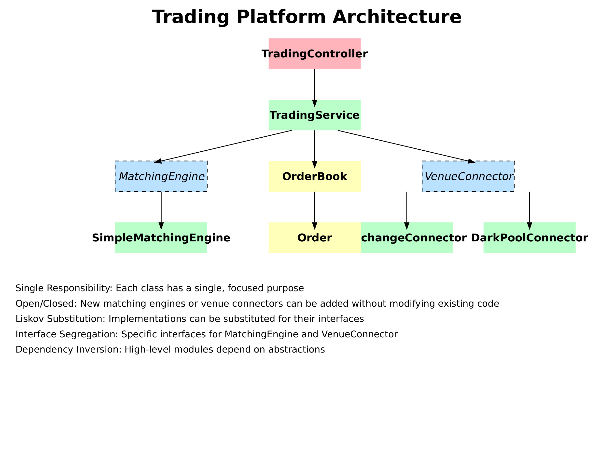

# Trading Platform

## 1. Project Overview

This trading platform is a Spring Boot application that simulates a basic trading system. It allows users to place buy and sell orders for financial instruments, matches these orders using a simple matching engine, and provides market price information. The system is designed with scalability and performance in mind, using efficient data structures for order management and processing.

Key Features:
- Place buy and sell orders
- Cancel existing orders
- Retrieve current market prices
- Simple order matching algorithm
- RESTful API for easy integration

## 2. How to Run the Project

1. Ensure you have Java JDK 11 or later and Maven installed on your system.

2. Clone the repository:
   ```
   git clone
   cd trading-platform
   ```

3. Build the project:
   ```
   mvn clean install
   ```

4. Run the application:
   ```
   mvn spring-boot:run
   ```

The application will start and be available at `http://localhost:8080`.

## 3. How to Run the Tests

To run the automated tests:

1. Ensure you're in the project root directory.

2. Run the following command:
   ```
   mvn test
   ```

This will execute all unit tests and integration tests.

## 4. Project Structure

The project follows a standard Spring Boot application structure:

Key Classes:
- `Application.java`: The main entry point of the application.
- `TradingController.java`: Handles HTTP requests and responses.
- `TradingService.java`: Contains the business logic for trading operations.
- `SimpleMatchingEngine.java`: Implements the order matching algorithm.
- `OrderBook.java`: Manages the collection of orders.
- `Order.java`: Represents an individual order.



The diagram shows:

The top-level TradingController which interacts with the TradingService.
The TradingService using both the OrderBook and MatchingEngine.
The SimpleMatchingEngine implementing the MatchingEngine interface.
The Order class being used by the OrderBook.
The VenueConnector interface with its implementations for different types of venues.

## 5. SimpleMatchingEngine Algorithm

The `SimpleMatchingEngine` class implements a basic price-time priority matching algorithm:

1. When a new order arrives, it's compared against existing orders on the opposite side of the order book.
2. Orders are matched based on price priority (best price first) and then time priority (first-in-first-out for orders at the same price).
3. If a match is found, a trade is executed at the price of the resting order.
4. Partial fills are supported, with any remaining quantity added to the order book.
5. The process continues until the incoming order is fully filled or there are no more matching orders.

This algorithm ensures fair and efficient order execution while maintaining the integrity of the order book.

## 6. OrderBook Data Structure

The `OrderBook` class uses a combination of data structures for efficient order management:

- A `HashMap` is used for quick order retrieval and updates. The key is the order ID, and the value is the Order object.
  - Time Complexity: O(1) for insertion, deletion, and lookup operations.
  - Space Complexity: O(n), where n is the number of orders.

- Two `TreeMap`s (one for buy orders, one for sell orders) are used to maintain price-time priority.
  - Keys are prices, and values are PriceLevel objects (which contain orders at that price).
  - This allows for O(log n) insertion and deletion, and O(1) access to the best bid and ask prices.

The combination of these data structures allows for:
1. Constant-time lookup and updates of individual orders.
2. Efficient maintenance of the price-time priority for matching.
3. Quick access to the best bid and ask prices for market price calculations.

This design balances the need for fast order management with the requirements of the matching algorithm, providing a good foundation for a high-performance trading system.

## 6. Further Improvements
Obviously, this is running on memory, so the first thing I would do is

1) Ensure all the Orders are saved on a database such as Postgres
2) The Orderbook is essentially a transaction log of all buy and sell orders in this platform, so a time-series database would be beneficial, something like Amazon Quantum Ledger Database
3) The ExchangeConnector and DarkPoolConnector (not implemented currently) are simulating connections to the venues to pull market data - so in a production environment, they would be making various API calls, depending on the asset class we want to trade of course. For Cryptocurrencies, we can use a variety of options like Binance or Coinbase. If you want to connect to various Dark Pool sources to improve your strategies, then maybe Intrino.com can offer something new.